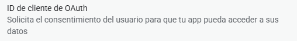
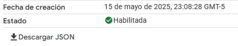
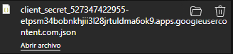
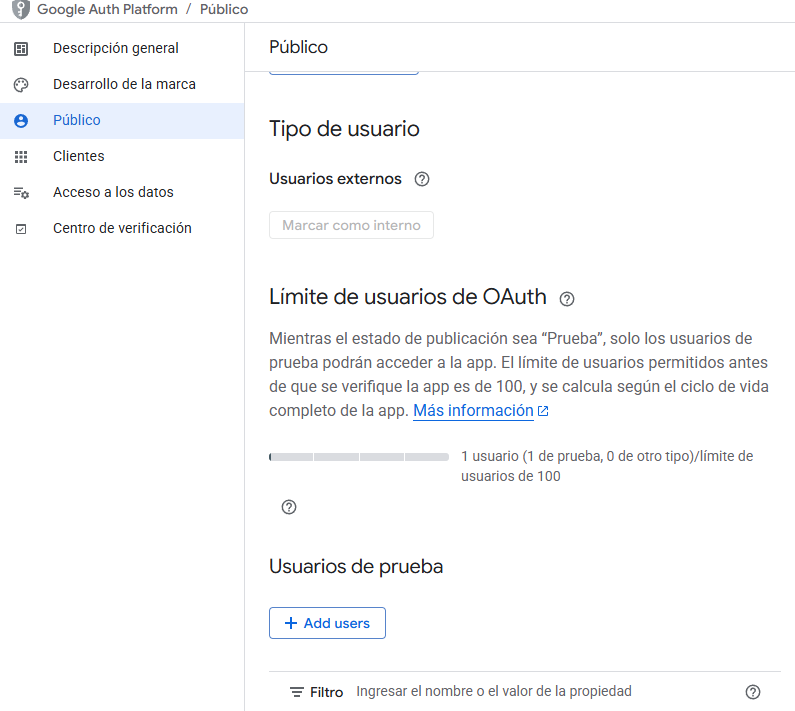
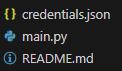

# 🚀 Configuración

## Requisitos previos

Instala los paquetes necesarios con pip:

```bash
pip install --upgrade google-api-python-client google-auth-httplib2 google-auth-oauthlib tqdm python-docx
```

## Proceso de configuración

### 1. Crear proyecto en Google Cloud Console

1. Visita la [Google Cloud Console](https://console.cloud.google.com/)
2. Crea un nuevo proyecto o selecciona uno existente
3. En el menú izquierdo, navega a:  
   `APIs y Servicios > Biblioteca`
4. Busca y habilita **Google Drive API** y **Forms API**
5. También puedes habilitar la API de Drive directamente [aquí Drive](https://console.cloud.google.com/apis/library/drive.googleapis.com) y [aquí Forms](https://console.cloud.google.com/apis/library/forms.googleapis.com)

### 2. Crear credenciales

1. En `APIs y Servicios > Credenciales`, haz clic en **Crear credenciales** (Si google te pide hacer otros pasos para tener credenciales hazlo)

   

2. Selecciona **ID de cliente OAuth**

   

3. Selecciona el tipo de aplicación: **App de escritorio** y siguente

   

4. Descarga el archivo de credenciales

   

5. Renombra el archivo descargado a `credentials.json` y colócalo en la raíz del proyecto

### 3. Agregar usuarios de prueba

1. Abre la Google Cloud Console y selecciona tu proyecto
2. En el menú lateral, ve a:  
   `APIs y servicios > Pantalla de consentimiento OAuth > Publico`
3. Desplázate hasta la sección **Usuarios de prueba**
4. Haz clic en el botón **+ Add users**
5. Ingresa la dirección de correo electrónico de los usuarios que quieres agregar
6. Presiona **Agregar** para guardar los cambios

   

> **Nota importante**: Solo los usuarios agregados como "Usuarios de prueba" podrán autorizar la aplicación mientras esté en modo prueba.


## Solución de problemas

Si encuentras problemas durante la configuración:

1. Verifica que hayas habilitado correctamente las APIs necesarias
2. Asegúrate de que el archivo `credentials.json` está en la ubicación correcta

   
   
3. Confirma que has agregado tu correo electrónico como usuario de prueba
4. Revisa los [foros de ayuda de Google Cloud](https://cloud.google.com/support-hub) para problemas específicos